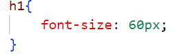

# Html & Css (Crash-Course)

> # Exploring Scrimba's 
> https://scrimba.com/learn/introhtmlcss
> - 31 Lessons (Including Introduction) 
> - 4 Hour 

> THE BUILDING BLOCKS OF THE WEB
>-  HTML
>- CSS
>- Java - Script

> # HTML
>- Hyper Text Markup Laguage
>- The content of website

> # CSS
>- Cascading Style Sheets
>- How our websites look

> # Java Script
>- Programming Language
>- Can manipulate HTML and CSS

> # The Fronted and Carrer Path
> 

>
> Html is a very Simple language:
>that tells the browser what the content we are writing actually is : Heading or paragraph ?
>
> Basis Tags :
> <Think of a Book>
> A boook has a cover. Inside the cover, we have many page. On each page, we have things like titles, subhradings, paragraphs, page  numbers, etc.
> <cover>(Opening Cover)
> </cover> (Closing Tag)
> Together opening and closing tag is called as element
> <cover>
><pages></pages>
><pages></pages>
></cover>

> Tags are inside of <>
> Closing tags include a forward slash </>
> Every thing from the opening and closing tag is called an element

>  # Basic file structure
> 
>
> Tags to make sentence **BOLD**
>- ``<strong>Hey Jazz!</strong>``
>- ``<b>Hello, David!</b>``
>
> Tags to make sentence *Italic*
>- ``<i>How're you ?</i>``
>- ``<em>Fine!</em>``
>
> Tags to link another Page/Web
>- ``<a href="https://mail.google.com/">Mail</a>``
>- a = tag
>- href = attribute
>
>
> # Introduction to CSS
>- It's all about Style!
> CSS is all about **property : value;** pairs
>- Properties are what we want to change, Like : font , color, font-weight....
>- value are what we want to set that property to, font-size : 21px;
>- - The Syntax : ``font-size: 21px;``
>- - The Style attribute: ``
this is paragraph</a>``
>- we can write *CSS* inside a style attribute

> # HTML lists
> Two types of list
>- Order list ``<ol>``
>- Unorderd list ``<ul>``
>- list item ``<li>``

> # Images
> Images are like links, in that they require an attribute to work
>- ``<image src="image-1.png">``
>- ``<image src="https://images.app.goo.gl/gtetUDziM4r7oejt5">``

##  ASSIGNMENT 1
> (I would prefer you to before going to solution first go though *instruction.txt* file and try to do assignment by your-self.)

> # Types of CSS
> **Internal CSS**
>
>- ``<head>``
>- ````
>- ``</head>``
>
*But how do we choose what we want to style?*
>- Selectors 
> ``body{ always followed by {}
        color : #323232;`` don't forget the semi-colon! 
    }``
>
> **External CSS**
> *Internal CSS is awesome. but what if we want to change the background color, or text color, to be the same on all our pages?*
> ``file name extension : %.css`` here %represents any name.
> *With an external css file, we can have one stylesheet controlling all of our pages at the same time.*
> *How to add External css file in html*
> ``<link rel="stylesheet" href="earth_mars.css">``

> # Three primary ways to select something
> Element selector
>- 
>> Class selector
>- 
>> ID selector
>- 
> # ID vs Class
>- ID is an individual, It can be used on time per page
>- A class is a group, it can be used over and over
>- ID will overwrite a class if they are both selecting the samething.
> # Comments in html
> ``<!-- comment here -->``
> # Comments in CSS
> ``/* comment here */``
> # There are several "Layout" related tags.
> - header 
> - footer
> - main
> - nav
> - section
> - div(generic)

> # Margins And Padding
>- **Margins :** Margins are used to control the postion of an element relative to those around it.
>- - margin-left
>- - margin-right
>- - margin-top
>- - margin-bottom
>- - ``margin: 10px 10px 10px 10px;``(top right bottom left)
>- - ``margin: 10px;``(All sides)
>- - ``margin: 10px 20px``(top and bottom , left and right)

>- **Padding :** Padding is used to control the postion of content inside our element.
>- *It works just like margins in terms of the long form and shorthand properties*
 
> # Borders
> *Borders add aborder around your element. they are similar to a stroke if you are used to vector software.*
>- **It takes three Properties to set a border** 
>- - border-width
>- - border-style
>- - border-color
> 

># Bootstrap
> **What is Bootstrap ?**
>
> *Bootstrap is responsive framework...*

> # Some Basic Properties of CSS
> ``font-family: Arial, Helvetica, sans-serif;``
>
> ``border: border-box;``
>
> ``color: #fdd037;``
>
> ``height: 55px;``
>
> ``width: 100%;``
>
> ``background-color: #244d61;``
>
> ``align-items: center;``
>
> ``justify-content: space-evenly;``
>
> ``padding: 5px;``
>
> ``display: flex;``
>
# Congratulations💥💥
# You're done with basics of Html & CSS.💐💐